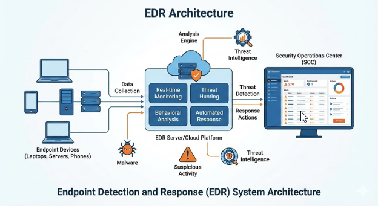
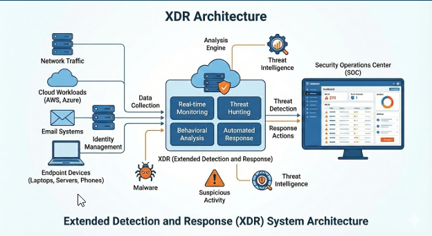

# Technical Analysis: EDR and XDR Solutions
**Prepared by:** ABDUL Aziz TAIBA

---

## 1. Executive Summary
In the current cybersecurity landscape, traditional signature-based defenses are no longer sufficient. As threats become more sophisticated, organizations must shift toward behavioral-based detection. This documentation provides a deep technical analysis of Endpoint Detection and Response (EDR) and its evolutionary successor, Extended Detection and Response (XDR), focusing on their architectures, capabilities, differences, and deployment criteria.

---

## 2. Endpoint Detection and Response (EDR)
EDR is an enterprise-grade security solution that focuses on monitoring and protecting individual devices (endpoints) such as laptops, servers, and mobile devices.

### EDR Architecture

### Key Functionalities & Core Components
- **Continuous Monitoring & Data Collection:** Records telemetry via lightweight agents installed on endpoints.
- **Centralized Analytics:** Processes endpoint telemetry to identify suspicious patterns.
- **Automated Response:** Ability to trigger immediate defensive actions like isolating a compromised host.
- **Forensic Data Retention:** Stores historical event logs for deep incident investigation and threat hunting.

---

## 3. Extended Detection and Response (XDR)
XDR is an integrated, cross-layered security approach that correlates data from multiple security tiers—including endpoints, networks, cloud workloads, and identity management into a unified dashboard.

### XDR Architecture

### Key Functionalities & Core Components
- **Breaking Down Data Silos:** Allows security operations centers (SOC) to gain full visibility into the entire attack path across the network rather than just a single device.
- **Unified Data Lake:** A centralized infrastructure repository for telemetry ingested from diverse security tools.
- **Advanced Correlation Engines:** Leverages analytics to link network scans, suspicious emails, and anomalous endpoint processes.
- **Ecosystem-Wide Response:** Triggers coordinated automated actions across different layers, such as blocking an IP at the firewall while disabling a compromised user account in Active Directory.

---

## 4. Architectural Comparison
Below is a detailed engineering evaluation of both solutions based on enterprise deployment criteria:

| Criteria | EDR | XDR |
| :--- | :--- | :--- |
| **Scope of Visibility** | Limited to Endpoints. | Endpoints, Network, Cloud, Email, and Identity. |
| **Detection Methods** | Behavioral analysis on host-level events. | Holistic correlation across multiple vectors. |
| **Response Actions** | Host-centric (Isolate, Kill process). | Ecosystem-wide (Block IP, Revoke Token, Isolate Host). |
| **Integration** | Often standalone or API-based. | Native integration across the security stack. |
| **Ease of Management** | High for endpoint teams. | Complex; requires centralized SOC expertise. |
| **Cost Matrix** | Generally lower (per-agent pricing). | Higher (platform-based or data-volume pricing). |
